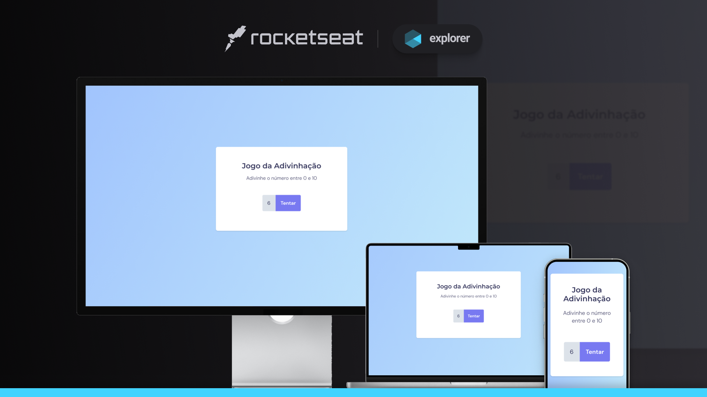

<h1 align="center">Projeto 14 da trilha Explorer</h1>
<blockquote align="center"> 
S T A G E &nbsp 0 5 
 
<strong>Avançando no JavaScript</strong>
  
</blockquote>

  

<blockquote>
<h3 align="center">🚀 Tecnologias</h3>

Esse projeto foi desenvolvido com as seguintes tecnologias: <strong>HTML</strong> &nbsp | &nbsp <strong>CSS</strong>  &nbsp | &nbsp  <strong>JavaScript</strong> &nbsp | &nbsp  <strong>Git e GitHub</strong>

 
</blockquote>

<blockquote>
<h3 align="center">💻 Projeto</h3>

O projeto em questão faz parte do Stage 05 ( "Avançando no JavaScript"), especificamente da sessão "Jogo da Adivinhação", da trilha Explorer, promovida pela <a href="https://rocketseat.com.br/" target="_blank">Rocketseat</a>.

 
</blockquote>