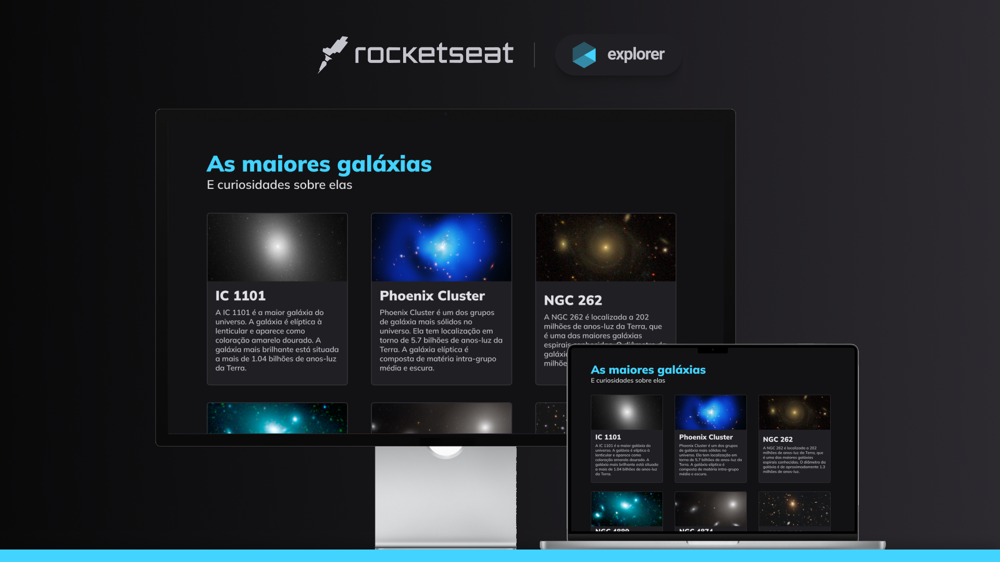

<strong style="font-size:26px; color: #996eff"> Projeto 10 da trilha Explorer</strong>

## 👁 Preview

  

## 🚀 Tecnologias

Esse projeto foi desenvolvido com as seguintes tecnologias:

- HTML e CSS
- Git e Github

## 💻 Projeto

O projeto em questão faz parte do Stage 03 ("Avançando no HTML e CSS"), especificamente da sessão "Iniciando com o Grid", da trilha Explorer, promovida pela <a href="https://rocketseat.com.br/" target="_blank">Rocketseat</a>.